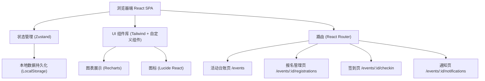
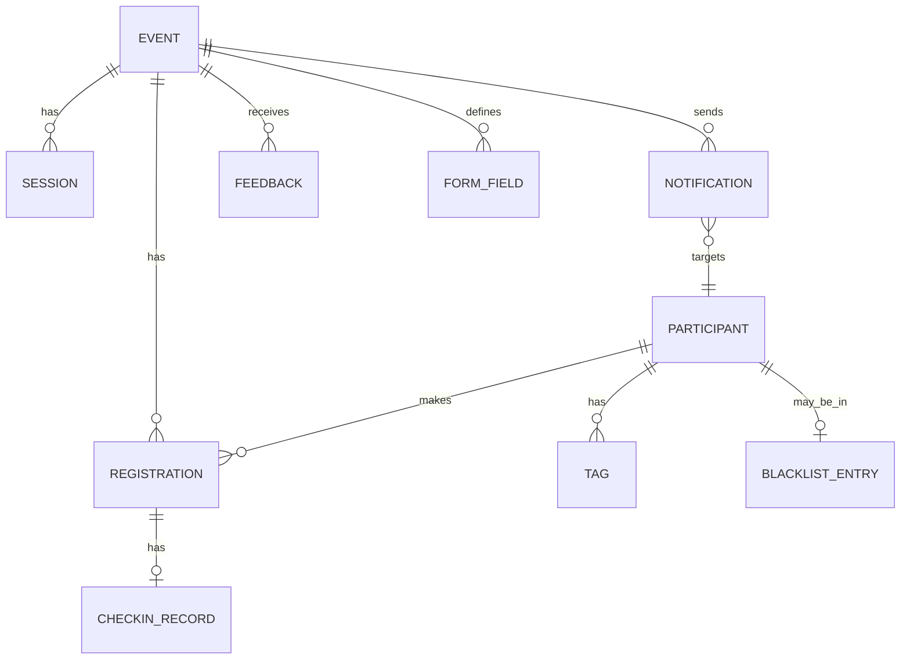

## 1. 架构设计



## 2. 技术选型

- **前端框架**：React@18 + TypeScript
- **构建工具**：Vite@5
- **样式方案**：TailwindCSS@3 + PostCSS
- **状态管理**：Zustand（轻量级，适合中小规模应用）
- **路由管理**：React Router@6
- **图表库**：Recharts（到场率、反馈统计图表）
- **图标库**：Lucide React（线性图标，文艺风格适配）
- **数据持久化**：LocalStorage（前端 Mock 数据）
- **表单处理**：React Hook Form + Zod 校验
- **拖拽交互**：@dnd-kit（报名表字段拖拽排序）

## 3. 路由定义

| 路由路径 | 页面用途 | 关键参数 |
|----------|----------|----------|
| `/` | 重定向至活动台账 | - |
| `/events` | 活动台账页（活动列表、新建、筛选） | - |
| `/events/new` | 新建活动表单页 | - |
| `/events/:id/overview` | 单活动总览（入口分流） | id: 活动ID |
| `/events/:id/registrations` | 报名管理页 | id: 活动ID |
| `/events/:id/checkin` | 签到页 | id: 活动ID |
| `/events/:id/notifications` | 通知页 | id: 活动ID |
| `/events/:id/review` | 活动复盘总结页 | id: 活动ID |
| `/blacklist` | 全局黑名单管理 | - |
| `/tags` | 参与者标签管理 | - |

## 4. 数据模型

### 4.1 实体关系图



### 4.2 类型定义（TypeScript）

```typescript
// 活动状态枚举
type EventStatus = 'draft' | 'published' | 'registration_open' | 'upcoming' | 'ongoing' | 'completed' | 'cancelled';

// 报名状态枚举
type RegistrationStatus = 'pending' | 'confirmed' | 'waitlist' | 'cancelled' | 'checked_in' | 'no_show';

// 通知类型枚举
type NotificationType = 'sms' | 'in_app' | 'email';
type NotificationStatus = 'draft' | 'scheduled' | 'sending' | 'sent' | 'failed';

// 活动
interface BookClubEvent {
  id: string;
  title: string;
  description: string;
  bookTitle?: string;
  bookAuthor?: string;
  coverImage?: string;
  status: EventStatus;
  startTime: string;
  endTime: string;
  location: string;
  maxCapacity: number;
  waitlistCapacity: number;
  currentConfirmed: number;
  currentWaitlist: number;
  cancelDeadlineHours: number;
  cancellationFeePercent: number;
  autoPromoteWaitlist: boolean;
  formFields: FormField[];
  tags: string[];
  notes: string;
  createdAt: string;
  updatedAt: string;
}

// 报名表自定义字段
interface FormField {
  id: string;
  name: string;
  label: string;
  type: 'text' | 'textarea' | 'select' | 'checkbox' | 'radio' | 'tel' | 'email';
  required: boolean;
  options?: string[];
  placeholder?: string;
  sortOrder: number;
}

// 参与者
interface Participant {
  id: string;
  name: string;
  phone: string;
  email?: string;
  avatar?: string;
  tags: string[];
  totalRegistrations: number;
  totalCheckIns: number;
  createdAt: string;
}

// 报名记录
interface Registration {
  id: string;
  eventId: string;
  participantId: string;
  status: RegistrationStatus;
  waitlistPosition?: number;
  customFields: Record<string, string>;
  registeredAt: string;
  cancelledAt?: string;
  cancelReason?: string;
  promotedFromWaitlistAt?: string;
}

// 签到记录
interface CheckInRecord {
  id: string;
  registrationId: string;
  eventId: string;
  participantId: string;
  checkedInAt: string;
  checkInMethod: 'qr_code' | 'manual' | 'walk_in';
  operatorId?: string;
}

// 通知
interface Notification {
  id: string;
  eventId?: string;
  type: NotificationType;
  title: string;
  content: string;
  templateId?: string;
  recipientFilters: {
    statuses?: RegistrationStatus[];
    tags?: string[];
  };
  scheduledAt?: string;
  status: NotificationStatus;
  totalRecipients: number;
  sentCount: number;
  failedCount: number;
  createdAt: string;
  sentAt?: string;
}

// 黑名单
interface BlacklistEntry {
  id: string;
  participantId: string;
  reason: string;
  blockedAt: string;
  expiresAt?: string;
  blockedBy: string;
}

// 反馈
interface Feedback {
  id: string;
  eventId: string;
  participantId: string;
  rating: number; // 1-5
  content: string;
  keywords: string[];
  submittedAt: string;
}

// 参与者标签
interface ParticipantTag {
  id: string;
  name: string;
  color: string;
  description?: string;
  participantCount: number;
}
```

## 5. 状态管理设计

```typescript
// Zustand Store 设计
interface AppState {
  // 活动相关
  events: BookClubEvent[];
  currentEventId?: string;
  
  // 当前视图参与者/报名数据
  registrations: Registration[];
  participants: Participant[];
  checkIns: CheckInRecord[];
  
  // 通知与反馈
  notifications: Notification[];
  feedbacks: Feedback[];
  
  // 全局配置
  blacklist: BlacklistEntry[];
  tags: ParticipantTag[];
  
  // Actions
  createEvent: (data: Partial<BookClubEvent>) => void;
  duplicateEvent: (eventId: string) => string;
  updateEvent: (id: string, data: Partial<BookClubEvent>) => void;
  addRegistration: (eventId: string, data: Omit<Registration, 'id'>) => void;
  cancelRegistration: (regId: string, reason?: string) => void;
  checkIn: (regId: string, method: CheckInRecord['checkInMethod']) => boolean;
  bulkNotify: (notification: Omit<Notification, 'id'>) => Promise<void>;
  addToBlacklist: (participantId: string, reason: string) => void;
}
```

## 6. 目录结构

```
src/
├── assets/                  # 静态资源（纸张纹理、装饰元素）
│   ├── textures/
│   └── fonts/
├── components/              # 通用组件
│   ├── layout/             # Sidebar, Topbar, Breadcrumb
│   ├── ui/                 # Button, Card, Badge, Modal, Table
│   └── forms/              # FormFieldRenderer, TagSelector
├── pages/                   # 页面级组件
│   ├── events/
│   │   ├── EventList.tsx          # 活动台账
│   │   ├── EventForm.tsx          # 新建/编辑活动
│   │   └── detail/
│   │       ├── EventOverview.tsx  # 活动总览（入口）
│   │       ├── Registrations.tsx  # 报名管理
│   │       ├── CheckIn.tsx        # 签到页
│   │       ├── Notifications.tsx  # 通知页
│   │       └── Review.tsx         # 复盘总结
│   ├── Blacklist.tsx
│   └── Tags.tsx
├── store/                   # Zustand stores
│   ├── useEventStore.ts
│   ├── useRegistrationStore.ts
│   └── useNotificationStore.ts
├── types/                   # TypeScript 类型定义
│   └── index.ts
├── utils/                   # 工具函数
│   ├── date.ts
│   ├── qrcode.ts            # 签到码生成
│   ├── statistics.ts        # 统计计算
│   └── mockData.ts          # 初始化示例数据
├── styles/                  # 全局样式与主题
│   ├── globals.css
│   └── theme.ts
├── App.tsx
├── main.tsx
└── router.tsx
```

## 7. Mock 数据说明

- 内置 5-8 个示例活动（覆盖草稿/报名中/即将开始/进行中/已完成各状态）
- 每个活动包含 20-50 条示例报名记录（含候补名单）
- 预置 10+ 个参与者标签（「老会员」「学生」「作家」「书评人」等）
- 生成历史活动的签到数据与反馈数据，用于复盘图表展示
