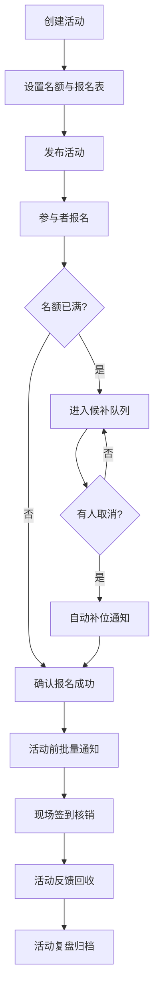
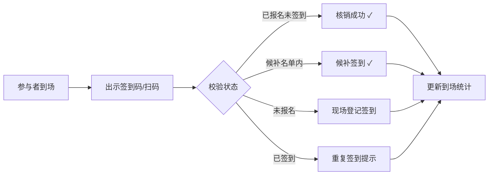

## 1. 产品概述

独立书店读书会管理系统，为书店店员和活动负责人提供一站式活动全流程管理。
- 核心解决：报名管理分散、签到效率低、通知碎片化、活动复盘困难等痛点
- 目标用户：独立书店店员、活动负责人、读书会组织者
- 产品价值：从活动创建到复盘闭环，减少工具切换，提升活动运营效率

## 2. 核心功能

### 2.1 用户角色

| 角色 | 登录方式 | 核心权限 |
|------|----------|----------|
| 店员/活动负责人 | 账号登录（演示版本默认已登录） | 活动创建、名单管理、签到核销、批量通知、数据统计 |
| 参与者 | 无需登录（通过外部链接） | 报名、签到、查看活动信息、提交反馈 |

### 2.2 功能模块

1. **活动台账页**：活动列表、活动新建/复制、活动状态管理、历史活动复盘
2. **报名管理页**：报名表自定义、报名列表、候补补位、黑名单管理、参与者标签
3. **签到页**：签到码生成核销、手动签到、到场率实时统计
4. **通知页**：批量通知模板、通知记录、取消规则配置、反馈回收

### 2.3 页面详情

| 页面名称 | 模块名称 | 功能描述 |
|-----------|-------------|---------------------|
| 活动台账 | 活动卡片列表 | 展示活动状态、时间、名额、报名进度，支持按状态/时间筛选 |
| 活动台账 | 新建/复制活动 | 基础信息录入、场次名额设置、取消规则配置，支持一键复制往期活动 |
| 活动台账 | 活动详情入口 | 从单个活动卡片进入名单、签到、通知、总结子页，保持上下文 |
| 活动台账 | 历史复盘 | 展示往期活动到场率、反馈汇总、成本收益等关键指标 |
| 报名管理 | 报名表配置 | 自定义字段（姓名/手机/邮箱/自定义问题），设置是否必填 |
| 报名管理 | 报名名单 | 已报名列表、候补列表、状态流转（待确认→已确认→已取消→候补→补位） |
| 报名管理 | 黑名单管理 | 拉黑/解除、拉黑原因记录、报名时自动拦截 |
| 报名管理 | 参与者标签 | 自定义标签、批量打标签、按标签筛选 |
| 签到页 | 签到码核销 | 生成动态签到码、扫码核销、手动搜索签到 |
| 签到页 | 实时统计 | 已到/未到/候补到场人数、到场率百分比 |
| 签到页 | 异常处理 | 未报名现场签到、重复签到提示、手动补录 |
| 通知页 | 批量通知 | 按标签/状态筛选受众、短信/站内信模板编辑、定时发送 |
| 通知页 | 取消规则 | 设置取消截止时间、违约金比例、候补自动补位开关 |
| 通知页 | 反馈回收 | 反馈问卷配置、反馈列表统计、评分汇总 |
| 通知页 | 通知记录 | 历史发送记录、发送状态、送达统计 |

## 3. 核心流程

### 3.1 活动创建与报名流程

活动负责人创建活动 → 设置场次名额与报名表 → 发布活动 → 参与者报名 → 自动/人工审核 → 候补队列 → 临近活动批量通知 → 活动当日签到 → 活动后反馈回收 → 复盘归档

### 3.2 签到与核销流程

## 4. 用户界面设计

### 4.1 设计风格
- **主色调**：墨绿 #2D4A3E（书店文化感）+ 暖橙 #E8A87C（活动活力）
- **辅助色**：米白 #F5F1EB（纸质阅读感）、深棕 #3E2723（古典书籍）
- **按钮风格**：微圆角（8px）、轻微阴影、悬停上浮效果
- **字体**：标题用「思源宋体」（文学质感），正文用「Noto Sans SC」（易读性）
- **布局风格**：卡片式布局 + 左侧导航 + 顶部活动上下文面包屑
- **图标风格**：线性图标，融入书本、羽毛笔、书签等文艺元素
- **装饰元素**：纸张纹理背景、微弱的下划线动画、卡片轻微浮起

### 4.2 页面设计概览

| 页面名称 | 模块名称 | UI 元素 |
|-----------|-------------|----------|
| 活动台账 | 活动卡片 | 左侧色条标识状态、进度条展示报名率、悬浮快捷操作菜单 |
| 活动台账 | 筛选工具栏 | 标签式状态筛选 + 日期范围选择 + 搜索框（毛玻璃效果） |
| 报名管理 | 名单表格 | 斑马纹行、状态徽章、批量操作勾选框、右键菜单 |
| 报名管理 | 字段配置 | 拖拽排序字段、字段类型选择器、实时预览报名表单 |
| 签到页 | 签到看板 | 大字报式统计面板、环形进度条、实时流水列表 |
| 签到页 | 核销区域 | 中央大扫码框、扫描动画、成功/失败状态动效 |
| 通知页 | 编辑器 | 富文本模板编辑、变量插入（{姓名} {活动名}）、发送预览 |
| 通知页 | 反馈统计 | 评分星图分布、词云展示关键词、满意度仪表盘 |

### 4.3 响应式
- **桌面端优先**：核心交互为桌面浏览器设计（1440px 基准）
- **平板适配**：侧边栏可折叠，卡片网格自适应列数
- **移动端**：签到页优化扫码体验，通知页支持手指滑动切换
- **触控优化**：最小点击区域 44px，滑动手势支持表格左右滚动

### 4.4 动效与交互
- 页面切换：左侧滑入过渡（300ms ease-out）
- 卡片悬浮：Y 轴 -4px + 阴影加深（150ms）
- 签到成功：绿色对勾扩散动画 + 轻微震动反馈
- 数据加载：骨架屏占位 + 淡入显示
- 通知发送：进度条 + 成功计数递增动画
